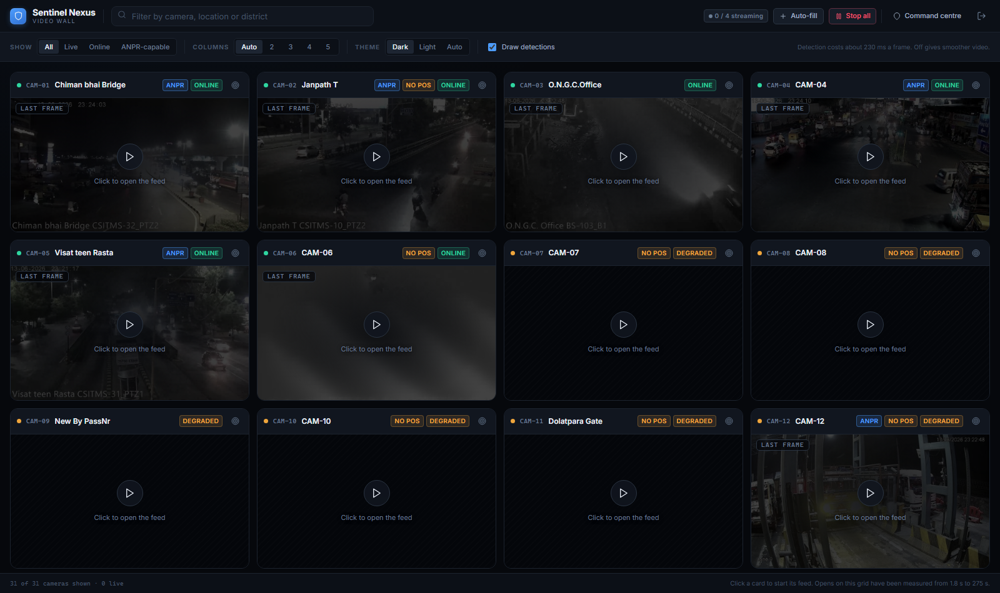

<p align="center">
  
</p>

<h1 align="center">Sentinel Nexus</h1>

<p align="center">
  <b>Unified CCTV Interoperability & Intelligence Platform</b><br/>
  Camera federation · Live video processing · ANPR · Cross-camera vehicle tracking · Watchlist alerting · GIS command & control
</p>

<p align="center">
  
  
  
  
  
  
  
</p>

---

## Overview

Sentinel Nexus is a **statewide surveillance interoperability layer** built against the Sentinel government CCTV grid — **30 live Ahmedabad ITMS traffic cameras**, mixed H.264/H.265 codecs, resolutions from 960×576 to 2560×1440.

> **Design principle:** Existing departmental systems keep running. Sentinel Nexus adds a common interoperability and intelligence layer on top — it never replaces the infrastructure underneath.

### Key Capabilities

| Capability | Description |
|---|---|
| **Camera Federation** | Pluggable connectors (RTSP, HLS, catalogue) — ONVIF/VMS adapters slot into the same ABC |
| **Vehicle Detection** | YOLO11 on ONNX Runtime — 1.83× more vehicles than YOLOv4-tiny at the same cost |
| **ANPR Pipeline** | Localise → restore → OCR → normalise → multi-frame vote — reads plates down to ~60 px |
| **Cross-Camera Tracking** | Plate, attribute, and free-text search across the entire camera estate |
| **Real-Time Alerts** | Watchlist matching with instant WebSocket push notifications |
| **GIS Command Centre** | Map-first UI with live OSM context layers (districts, highways, police stations, toll plazas) |
| **Live Preview** | MJPEG stream with detection bounding boxes drawn on — plain ``, no player library |
| **Health Monitoring** | Measured camera availability (probed, not trusted) |
| **Bulk Import** | Reads a department's own spreadsheet with automatic column mapping |
| **Auth & RBAC** | JWT authentication with Admin / Operator / Analyst roles + full audit trail |
| **Reports** | CSV detection logs and PDF evidence reports |

---

## Quick Start

### One-Click Launch (Recommended)

```bash
python run.py
```
*(or `py run.py` on Windows)*

This single command:
1. Creates a Python virtual environment (`.venv-clean`)
2. Installs all pinned dependencies
3. Downloads detector weights (~38 MB YOLO11 + ~24 MB fallback)
4. Seeds the database with 30 cameras and demo accounts
5. Starts the server and opens the browser

### Manual Launch

```bash
cd backend
../.venv-clean/Scripts/python.exe -m uvicorn app.main:app --port 8000
```

### Access

| | URL |
|---|---|
| **Command Centre** | http://localhost:8000 |
| **API Docs (Swagger)** | http://localhost:8000/docs |
| **Health Check** | http://localhost:8000/health |

### Demo Accounts

| Role | Username | Password |
|---|---|---|
| Admin | `admin` | `sentinel-admin` |
| Operator | `operator` | `sentinel-operator` |
| Analyst | `analyst` | `sentinel-analyst` |

---

## Architecture

```
                         SENTINEL NEXUS
                                |
        +-----------------------+-----------------------+
        |                                               |
  CAMERA REGISTRY                              CONNECTOR LAYER
  SQLite + cameras.json                    RTSP | HLS | CATALOGUE
  30 cams, lat/lon, codec, health         (ONVIF / VMS adapters slot
        |                                  into the same ABC)
        +-----------------------+-----------------------+
                                v
                     STREAM WORKER POOL
              RTSP/TCP · PTS clock · reconnect + backoff
              bounded concurrency · loop-point detection
                                v
                     +----------+----------+
                     |                     |
              OVERLAY OCR            VEHICLE DETECTOR
          (timestamp + site)     (YOLO11 / ONNX Runtime,
                                  YOLOv4-tiny fallback)
                     |                     |
                     |              +------+------+
                     |         PLATE DETECT   ATTRIBUTES
                     |              |        type / direction
                     |          PLATE OCR         |
                     +--------------+-------------+
                                    v
                            SIGHTING EVENT
              {plate?, type, direction, cam, lat/lon, ts, conf, evidence}
                                    v
                     +--------------+--------------+
              EVENT DATABASE                  WATCHLIST
                     |                             |
              CROSS-CAMERA TRACE            ALERT ENGINE
                     +--------------+--------------+
                                    v
                        FASTAPI + WEBSOCKET
                                    v
              COMMAND CENTRE UI (MapLibre GL, map-first)
           layers · video wall · evidence · trace · health
```

Every connector converts its source into the same `CameraDescriptor`, so nothing above the connector layer knows which protocol a camera speaks. `BaseConnector` is the abstract adapter — RTSP, HLS, and catalogue are implemented. ONVIF or a vendor VMS API would be a new subclass, not a change anywhere upstream.

> Full architecture rationale: [`docs/HLD.md`](docs/HLD.md)  
> Implementation plan & measurements: [`implementation.md`](implementation.md)

---

## Detection Pipeline

The detector is **YOLO11 on ONNX Runtime**, with YOLOv4-tiny on `cv2.dnn` kept as a fallback so the platform still detects if the ONNX fetch fails on a restricted network. Neither path needs PyTorch or the `ultralytics` package — the weights are consumed as plain `.onnx` graphs.

### Benchmark (40 night frames, CPU-only, 1080p)

| Model | Cost / frame | Vehicles / frame | vs YOLOv4-tiny |
|---|---|---|---|
| YOLOv4-tiny (previous) | 75 ms | 1.30 | — |
| **yolo11n** | **40 ms** | **2.33** | **1.79×** |
| **yolo11s** *(default)* | **80 ms** | **2.38** | **1.83×** |
| yolo11m | 221 ms | 1.95 | 1.50× |

**Why bigger is worse here:** yolo11m finds *fewer* vehicles than yolo11s while costing 2.8× more. A larger model is better calibrated and more willing to call a dim night blob "not a vehicle" — which is the wrong trade when the blob usually is one. The `high` hardware profile feeds the same model more cameras and more frames instead.

### ANPR Pipeline

```
Vehicle crop → Morphological localisation → Image restoration → PaddleOCR → Normalisation → Multi-frame voting
```

- Reads plates down to ~60 px width
- Indian registration format validation (`SENTINEL_PLATE_REGION=IN`)
- Multi-frame voting across tracked vehicles for consensus
- Detections are never fabricated — if a plate cannot be read, the system says so

---

## Command Centre UI

Map-first, served as static files from the same Python process — **no Node toolchain, no bundler, no `node_modules`, no build step**. Open `/` and it runs.

The map is the background of the whole application. Everything else floats over it: layer controls, a right-hand slide-over for detail, and a dockable video wall.

| Panel | Purpose |
|---|---|
| **Layers** | Filter by owning department and ANPR capability independently |
| **Cameras** | Browse the estate; unplaced cameras are surfaced, not silently hidden |
| **Registry** | Bulk import from a department's spreadsheet with column-mapping preview |
| **ANPR Events** | Every reading with its plate crop and boxed full frame |
| **Tracing** | A plate's route across cameras with a playback slider |
| **Watchlist** | Live alerts over WebSocket — the pin flashes and the map pans to it |
| **Health** | Measured vs reported availability |
| **Guide** | Scripted walkthrough that drives the real interface |

### GIS Context Layers (Self-Hosted)

The map draws geography from layers fetched and cached from OpenStreetMap via the Overpass API — no third-party tile service required:

| Layer | Features Cached |
|---|---|
| District boundaries | 34 |
| National highways | 1,428 |
| Major roads | 7,813 |
| Ahmedabad street grid | 6,071 |
| Police stations | 100 |
| Toll plazas | 198 |
| Railway stations | 668 |

Operators with their own tile server can set `SENTINEL_BASEMAP_URL` to use it underneath all context layers.

---

## Installation

### Prerequisites

- **Python 3.12 or 3.13**
- Network access to the Sentinel grid (RTSP port 8554)
- No GPU required · No Docker · No PostgreSQL · No separate FFmpeg binary

> **⚠️ Use a clean virtualenv.** Do **not** use `--system-site-packages` or Anaconda. PyTorch is deliberately excluded — detection runs on ONNX Runtime (~15 MB wheel). Torch would also clash with PaddlePaddle over DLLs on Windows.

### Step-by-Step Manual Setup

**1. Clone & create virtualenv**

```bash
git clone https://github.com/krishivvyas/sentinal.git
cd sentinal

python -m venv .venv-clean

# Windows
.\.venv-clean\Scripts\pip.exe install -r backend/requirements.txt

# Linux / macOS
# ./.venv-clean/bin/pip install -r backend/requirements.txt
```

**2. Configure environment**

```bash
cp .env.example .env
# Edit .env — fill in RTSP credentials and set JWT_SECRET
```

**3. Download detector weights**

```bash
# Primary detector — YOLO11s (~38 MB)
curl -L -o models/yolo11s.onnx \
  https://huggingface.co/giangndm/yolo11-onnx/resolve/main/yolo11s_640.onnx

# Fallback detector — YOLOv4-tiny (~24 MB)
curl -L -o models/yolov4-tiny.weights \
  https://github.com/AlexeyAB/darknet/releases/download/yolov4/yolov4-tiny.weights
```

**4. Build the camera registry**

```bash
cd backend

# Probe every camera: codec, resolution, fps, health, triage score
python -m scripts.survey_cameras --frames 25 --workers 6

# Read overlays, geocode, cluster by time, seed the registry
python -m scripts.seed_registry --ai-top 8
```

**5. Start the server**

```bash
cd backend
..\.venv-clean\Scripts\python.exe -m uvicorn app.main:app --port 8000 --reload
```

---

## Configuration

All settings come from the environment or a `.env` file — never hardcoded. The file is read from the repo root first, then `backend/.env`. See [`backend/app/config.py`](backend/app/config.py).

### Core Settings

| Variable | Default | Purpose |
|---|---|---|
| `SENTINEL_PROFILE` | `balanced` | Hardware profile: `low` · `balanced` · `high` |
| `SENTINEL_MAX_STREAMS` | *(from profile)* | Hard cap on simultaneous open captures |
| `JWT_SECRET` | *(dev placeholder)* | **Must be changed in production** |
| `DATABASE_URL` | `sqlite:///backend/data/sentinel.db` | Swap to PostgreSQL/PostGIS here |

### Network & Feeds

| Variable | Default | Purpose |
|---|---|---|
| `SENTINEL_RTSP_HOST` | `103.250.160.189` | Grid RTSP endpoint |
| `SENTINEL_RTSP_PORT` | `8554` | Grid RTSP port |
| `SENTINEL_RTSP_USER` / `_PASSWORD` | *(empty)* | Basic auth credentials |
| `SENTINEL_HLS_COOKIE` / `_TOKEN` | *(empty)* | Portal session for HLS fallback |
| `SENTINEL_CATALOGUE_URL` | *(empty)* | Live `cameras.json` URL |

### Detection & ANPR

| Variable | Default | Purpose |
|---|---|---|
| `SENTINEL_DETECTOR` | `auto` | `auto` · `yolo11n/s/m/l` · `yolov4-tiny` |
| `SENTINEL_DETECTOR_THREADS` | `0` | ONNX intra-op threads (0 = all cores − 1) |
| `SENTINEL_DETECTOR_CONF` | `0.25` | Detection confidence floor |
| `SENTINEL_PLATE_DETECTOR` | `0` | Learned plate localiser (disabled by default) |
| `SENTINEL_PLATE_REGION` | `IN` | Plate layout: `IN` (Indian) or `GENERIC` |

### Map

| Variable | Default | Purpose |
|---|---|---|
| `SENTINEL_BASEMAP_URL` | *(empty)* | Raster tile URL; empty uses self-cached OSM layers |
| `SENTINEL_BASEMAP_ATTRIBUTION` | *(empty)* | Attribution text for custom tiles |

### Hardware Profiles

| Profile | Sample Interval | Concurrent Streams | Detector | Target Machine |
|---|---|---|---|---|
| `low` | 3000 ms | 2 | yolo11n | Old laptop, no GPU |
| `balanced` | 400 ms | 4 | yolo11s | Typical dev machine |
| `high` | 250 ms | 8 | yolo11s | Many-core server |

```bash
SENTINEL_PROFILE=low python -m scripts.verify_pipeline --camera CAM-04
```

---

## Scripts & Verification

### Live Pipeline Verification

```bash
python -m scripts.verify_pipeline --camera CAM-04 --seconds 180
```

### Live Ingest

```bash
python -m scripts.run_ingest --ai --seconds 600           # AI-triaged cameras
python -m scripts.run_ingest --cameras CAM-04 CAM-01 --seconds 300
python -m scripts.run_ingest --cameras CAM-04 --no-anpr    # Detection only
```

### Own-Feed Demonstration

The government grid cannot prove the ANPR path end-to-end (plates are 20–40 px at night). This runs the identical pipeline over close-range footage where plates are legible:

```bash
python -m scripts.demo_own_feed
```

Shows: detection → ANPR → watchlist match → alert firing.

---

## Project Structure

```
sentinal/
├── backend/
│   ├── app/
│   │   ├── api/
│   │   │   └── routes.py              # 36 REST endpoints + alert WebSocket
│   │   ├── connectors/                # Federation layer — one adapter per protocol
│   │   │   ├── base.py                #   BaseConnector ABC + CameraDescriptor
│   │   │   ├── catalogue.py           #   cameras.json (local file or authed URL)
│   │   │   ├── hls.py                 #   HLS fallback transport
│   │   │   └── rtsp.py                #   Primary RTSP/TCP transport
│   │   ├── models/
│   │   │   └── __init__.py            # Camera, Sighting, Watchlist, Alert, User, AuditLog
│   │   ├── pipeline/
│   │   │   ├── detect.py              #   Vehicle detection (YOLO11/ONNX + v4-tiny fallback)
│   │   │   ├── onnx_backend.py        #   ONNX Runtime inference engine
│   │   │   ├── ocr.py                 #   Plate OCR + normalisation + voting
│   │   │   ├── overlay.py             #   Burned-in timestamp & site-name OCR
│   │   │   ├── plate.py               #   Plate localisation & image restoration
│   │   │   ├── plate_detect.py        #   Learned plate localiser (ships disabled)
│   │   │   ├── track.py               #   IoU tracker for multi-frame voting
│   │   │   └── worker.py              #   PTS-driven stream worker + backoff + loop detection
│   │   ├── services/
│   │   │   ├── alerts.py              #   Alert engine + WebSocket broadcast
│   │   │   ├── gis.py                 #   OSM context layers via Overpass (cached)
│   │   │   ├── health.py              #   Camera probing — measured availability
│   │   │   ├── importer.py            #   CSV bulk import + column auto-mapping
│   │   │   ├── ingest.py              #   Per-camera ingest orchestration
│   │   │   ├── live.py                #   MJPEG live preview with detection overlays
│   │   │   ├── registry.py            #   Camera registry + metadata audit trail
│   │   │   ├── reports.py             #   CSV & PDF report generation
│   │   │   ├── search.py              #   Cross-camera plate & attribute correlation
│   │   │   ├── security.py            #   JWT auth, RBAC, audit logging
│   │   │   └── watchlist.py           #   Normalised storage + tolerant matching
│   │   ├── config.py                  # Env-driven settings + hardware profiles
│   │   ├── db.py                      # SQLAlchemy engine (SQLite → PostgreSQL swap)
│   │   └── main.py                    # FastAPI app — serves API + static UI
│   ├── static/                        # Command centre UI (no build step)
│   │   ├── index.html                 #   Main shell
│   │   ├── wall.html                  #   Video wall (standalone page)
│   │   ├── css/
│   │   │   ├── tokens.css             #   Design tokens (colour, type, space, motion)
│   │   │   ├── app.css                #   Layout and components
│   │   │   └── wall.css               #   Video wall styles
│   │   └── js/
│   │       ├── api.js                 #   REST client + session management
│   │       ├── app.js                 #   Shell: auth gate, rail, panel routing, alerts
│   │       ├── map.js                 #   MapLibre map, pins, GIS layers, trace
│   │       ├── basemap.js             #   Dark/light basemap palettes
│   │       ├── store.js               #   State management + subscribe/notify
│   │       ├── tour.js                #   Guided walkthrough
│   │       ├── ui.js                  #   DOM helpers, icons, formatting, toasts
│   │       ├── wall.js                #   Video wall dock
│   │       ├── wall-page.js           #   Standalone video wall logic
│   │       ├── theme.js               #   Theme switcher (video wall)
│   │       └── panels/
│   │           ├── camera.js           # Camera detail panel
│   │           ├── events.js           # ANPR events panel
│   │           ├── health.js           # Health monitoring panel
│   │           ├── layers.js           # Map layer controls
│   │           ├── registry.js         # Bulk import panel
│   │           ├── trace.js            # Cross-camera trace panel
│   │           ├── unplaced.js         # Unplaced cameras panel
│   │           └── watchlist.js        # Watchlist management panel
│   ├── data/                          # Generated at runtime (mostly gitignored)
│   │   ├── cameras.json               # THE CATALOGUE — camera registry source
│   │   ├── camera_survey.json         # Per-camera probe results + triage scores
│   │   ├── overlay_reads.json         # OCR'd overlay clocks + site names
│   │   ├── geocode_cache.json         # Nominatim lookups (cached)
│   │   ├── evidence/                  # Detection snapshots (gitignored)
│   │   ├── gis/                       # Cached OSM layers as GeoJSON (gitignored)
│   │   ├── thumbnails/                # Per-camera preview stills (gitignored)
│   │   ├── own_feed/                  # Close-range demo footage (gitignored)
│   │   ├── ocr_samples/              # Full-res OCR/ANPR test corpus (gitignored)
│   │   └── sentinel.db               # SQLite database (gitignored)
│   ├── scripts/
│   │   ├── survey_cameras.py          # Fleet probe + plate-readability triage
│   │   ├── seed_registry.py           # Catalogue build + geocode + time-cluster + seed
│   │   ├── run_ingest.py              # Live ingest against the grid
│   │   ├── verify_pipeline.py         # Live verification harness
│   │   └── demo_own_feed.py           # Own-feed ANPR demonstration
│   ├── tests/
│   │   ├── test_importer.py           # Column auto-mapping tests
│   │   ├── test_ocr_fallback.py       # OCR fallback path tests
│   │   ├── test_plate_crops.py        # Plate crop processing tests
│   │   └── test_scenery_suppression.py # Scenery suppression tests
│   ├── requirements.txt               # Pinned production dependencies
│   └── requirements-dev.txt           # Dev dependencies (pytest)
├── docs/
│   ├── HLD.md                         # High-level design document
│   └── submission/
│       ├── government_feed_detections.csv   # Detection log from the grid
│       └── own_feed_trace_MPE3389.pdf       # Evidence report from own-feed run
├── models/                            # Detector weights (downloaded by run.py, gitignored)
│   ├── yolo11s.onnx                   #   Primary detector (~38 MB)
│   ├── yolo11n.onnx                   #   Low-profile variant (~11 MB, optional)
│   ├── yolo11m.onnx                   #   Daylight variant (~80 MB, optional)
│   ├── plate-detector.onnx            #   Learned plate localiser (~10 MB, disabled)
│   ├── yolov4-tiny.cfg                #   Fallback config (committed)
│   └── yolov4-tiny.weights            #   Fallback detector (~24 MB)
├── .env.example                       # Template — copy to .env
├── .gitignore
├── run.py                             # One-click launcher & environment orchestrator
├── implementation.md                  # Full plan, measurements, daily schedule
├── context.md                         # Working context and session log
└── README.md
```

---

## The Catalogue Contract

The camera list is read from `cameras.json`, never hardcoded. Onboarding a camera means editing the catalogue, not the application:

```jsonc
{
  "version": 1,
  "source": "rtsp-discovery+overlay-ocr",
  "cameras": [
    {
      "id": "cam01",
      "camera_id": "CAM-01",
      "name": "Chiman bhai Bridge",
      "department": "SENTINEL-GOV",
      "district": "Ahmedabad",
      "lat": 23.0064, "lon": 72.5698,
      "location_accuracy": "APPROXIMATE",
      "rtsp": "rtsp://103.250.160.189:8554/stream/cam01",
      "codec": "H.264", "width": 1920, "height": 1080,
      "status": "ONLINE", "plate_score": 85.0,
      "time_cluster": 2
    }
  ]
}
```

**`location_accuracy`** is deliberate: `VERIFIED` (operator-supplied), `GEOCODED` (resolved + validated), `APPROXIMATE` (landmark estimate from overlay), `UNKNOWN` (not drawn on map). A confidently-wrong pin on a police map is worse than no pin.

---

## Field Rules Compliance

Each operational requirement was implemented and exercised against the live grid:

| Rule | Implementation |
|---|---|
| Force RTSP over TCP | `rtsp_transport;tcp` via `OPENCV_FFMPEG_CAPTURE_OPTIONS` before `cv2` import |
| HLS fallback when port 8554 blocked | `HLSConnector` — worker alternates to `fallback_url` after repeated failures |
| Never trust `CAP_PROP_FPS` | Stored as metadata only; never used in calculations |
| Drive timing from PTS | Sampling uses `CAP_PROP_POS_MSEC` exclusively, never arrival time |
| Tolerate inter-frame gaps | 16.2 s PTS gap survived live with 0 reconnects |
| Reconnect with backoff | 2 s → 30 s cap, interruptible wait, never a tight loop |
| Decoder warnings non-fatal | `OPENCV_FFMPEG_LOGLEVEL=-8`; logged once, self-correct at first IDR |
| Handle scene discontinuity | `detect_discontinuity()` on backward/large-forward PTS jumps |
| Pace the load | Global `_OPEN_SEMAPHORE` sized from hardware profile |

### Measured Throughput (CAM-04, 1080p, 180 s)

Using `cap.grab()` + conditional `cap.retrieve()` instead of `cap.read()`:

| Metric | Before | After |
|---|---|---|
| Frames delivered | 72 | **109** |
| PTS span covered | 95 s | **168 s** |
| Throughput | 0.53× real time | **0.91× real time** |

---

## What We Learned from the Feed

These findings shaped the architecture:

- **RTSP works; HLS requires auth.** RTSP is the primary transport. The grid began requiring Basic auth on 2026-09-02 — credentials are injected at connection time, never stored in the catalogue.
- **Reported frame rates are unusable.** CAM-06 reports 90,000 fps; CAM-30 reports 200. All timing comes from the decoder PTS and the burned-in overlay clock.
- **Every frame carries a burned-in overlay** with a wall-clock timestamp and site name. These are replayed recordings — the overlay clock is the authoritative event timestamp.
- **The cameras are not one synchronised network.** Overlay clocks span four recording dates and five time clusters. Cross-camera tracking only works within overlapping time clusters. The primary cluster (CAM-01, 02, 03, 04, 05, 09, 12, 13, 14) is the real tracking network.
- **Plate readability is the defining risk.** Wide-angle night PTZ cameras with 20–40 px plates. Mitigation: camera triage, plate-recovery preprocessing, multi-frame voting, and attribute-based sightings.
- **Vehicle colour is deliberately not derived.** Night lighting drives apparent hue more than paint does. A confident wrong colour is worse than none.

---

## Known Limitations

- **CPU-only processing.** AI runs on sampled frames across a selected camera subset. The architecture (pluggable connectors, stateless workers) is designed so statewide scaling means adding edge nodes, not redesigning the platform.
- **Concurrency is constrained.** At 10 simultaneous opens, five cameras returned no frames. Cameras are not marked dead on a single failure.
- **6 of 30 cameras are degraded** — decode corruption or no usable frames.
- **22 cameras have no trustworthy coordinates** — excluded from the map until set through the registry.
- **The venv is ~1 GB.** PaddlePaddle (360 MB) and OpenCV (124 MB) are the primary contributors. PaddleOCR pulls `imgaug` and `albumentations` unconditionally.
- **Map requires internet** for MapLibre GL JS from CDN. The rest of the UI works offline.
- **Auto-rickshaw labelling is heuristic.** COCO-trained weights have no auto-rickshaw class; a yellow-body-and-aspect-ratio test recovers the common case.

---

## Tech Stack

| Layer | Technology |
|---|---|
| **Backend** | Python 3.12+, FastAPI, SQLAlchemy, Uvicorn |
| **Detection** | YOLO11 (ONNX Runtime), YOLOv4-tiny (OpenCV DNN) |
| **OCR** | PaddleOCR (overlay + plate reading) |
| **Database** | SQLite (swappable to PostgreSQL/PostGIS) |
| **Auth** | JWT + bcrypt, role-based access control |
| **Frontend** | Vanilla HTML/CSS/JS — no build step, no Node |
| **Map** | MapLibre GL JS + self-cached OSM context layers |
| **Reports** | ReportLab (PDF), native CSV |

---

## Licence & Attribution

Built with open-source components: OpenCV, PaddleOCR, FastAPI, SQLAlchemy, MapLibre GL, ReportLab, and YOLOv4-tiny weights from the Darknet project.

Camera imagery belongs to the Sentinel/ITMS operator and is used for evaluation only.
